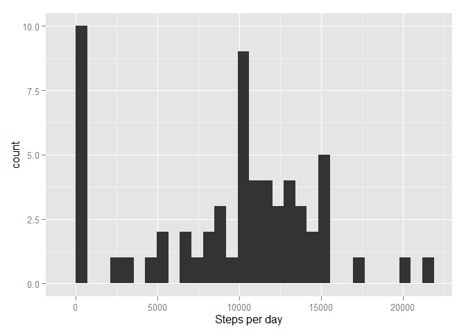
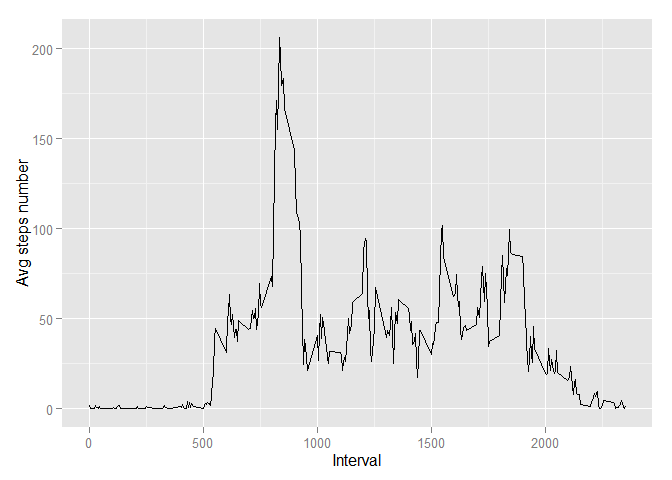
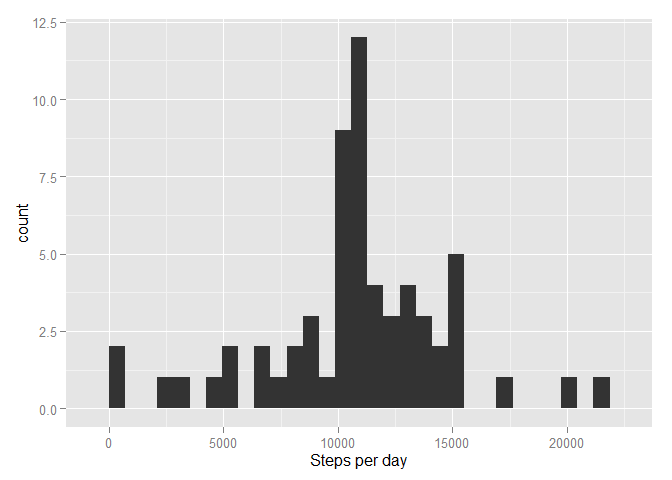
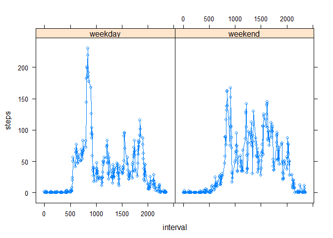

# Reproducible Research: Peer Assessment 1


## Loading and preprocessing the data
Used libraries, locale setup

```r
Sys.setlocale("LC_TIME", "English")
library(dplyr)
library(ggplot2)
library(lattice)
```

Loading data

```r
data <- read.csv(unzip('activity.zip'))
```
Setting column type for date

```r
data$date <- as.Date(data$date)
```


## What is mean total number of steps taken per day?

```r
stepsPerDay <- data %>%
  group_by(date) %>%
  summarise(steps = sum(steps, na.rm = T))

qplot(steps, data = stepsPerDay, geom = "histogram", xlab = 'Steps per day')
```

 

## What is the average daily activity pattern?


```r
stepsPerInterval <- data %>%
  group_by(interval) %>%
  summarise(steps = mean(steps, na.rm = T))

qplot(interval, y = steps, data = stepsPerInterval, geom = 'line', xlab = 'Interval', ylab = 'Avg steps number')
```

 

Which 5-min period contains maximal number of steps on average 

```r
stepsPerInterval %>%
  filter(steps == max(steps))
```

```
## Source: local data frame [1 x 2]
## 
##   interval    steps
##      (int)    (dbl)
## 1      835 206.1698
```

## What is mean total number of steps taken per day?

Median: 

```r
median(stepsPerDay$steps)
```

```
## [1] 10395
```

Mean: 

```r
mean(stepsPerDay$steps)
```

```
## [1] 9354.23
```

## Imputing missing values
Number of missing values

```r
dim(data[is.na(data$steps),])[1]
```

```
## [1] 2304
```

Creating new dataset with mean values set for NAs (each NA is replaced with average value for that interval from all days)

```r
newdata <- data
newdata$steps <- ifelse(is.na(newdata$steps), 
                        stepsPerInterval$steps[match(newdata$interval, stepsPerInterval$interval)], 
                        newdata$steps)
stepsPerDay <- newdata %>%
  group_by(date) %>%
  summarise(steps = sum(steps))

qplot(steps, data = stepsPerDay, geom = "histogram", xlab = 'Steps per day')
```

 

Imputing missing data has changed histogram:
* there is less days with least number of steps
* there is more days with average number of steps

Median: 

```r
median(stepsPerDay$steps)
```

```
## [1] 10766.19
```

Mean: 

```r
mean(stepsPerDay$steps)
```

```
## [1] 10766.19
```

## Are there differences in activity patterns between weekdays and weekends?

```r
newdata$day <- ifelse(weekdays(newdata$date) %in% c('Saturday', 'Sunday'), 'weekend', 'weekday')
stepsPerIntervalByDayType <- newdata %>%
  group_by(interval, day) %>%
  summarise(steps = mean(steps, na.rm = T))

xyplot(steps ~ interval | day, data=stepsPerIntervalByDayType, type='b')
```

 
